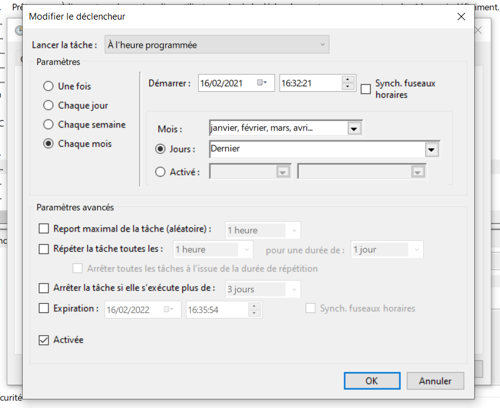

# Implementing a windows task to automatically update the plugin

## Requirements

In order to install the automatic update on different computers, the following requirements must be met : 

* Read access made available to each user on a specific folder (oneDrive, folder on the server) without any access conditions
* Write access for the admin on this folder
* Windows Task Scheduler and a Powershell > Powershell 2

### Supported windows Version

The following Windows version support the Task Scheduler

* Windows 10
* Windows 7
* Windows Server 2008 R2
* Windows Vista
* Windows Server 2008
* Windows Server 2003
* Windows Server 2019
* Windows XP
* Windows 2000

### Powershell Version

Check your powershell version by using the following command in a Powershell : 

```shell
Get-Host | Select-Object Version
```

## Admin installation

### Download the batch file

The batch file can be found [here](https://isogeodownloads.blob.core.windows.net/arcgis-pro/downloadPlugin.bat). 

### Create a scheduled task

Requirements :

* set up a shared folder accessible by all users

To create the task, do the following : 

* Open the task scheduler
* Click on `Task Scheduler Library` to display the scheduled task list.
* In `Action` > `Create Task...` :
* In `General`, select `Run whether user is logged on or not` and `Run with highest privileges` et select the correct Windows version. 


* In `Triggers`, create a new trigger and chose `on a schedule` and `Monthy`



* In `Actions`, create a new action et select `Start a program` et chose the update batch file et add the following arguments : 

```
"AddIn_path" >> "logs_path\plugin_arcgis_pro_logs.txt"
 ```

 

 * In `Settings`, select `Run task as soon as possible after a scheduled start is missed`, `Stop task if it runs longer than 1 hour` and `If the running task does not end when requested, force it to stop`

 

 * Run the task manually to check it worked. 

## User configuration

The user configuration is the same as in  [User configuration](./update.md). 