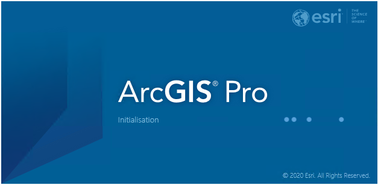
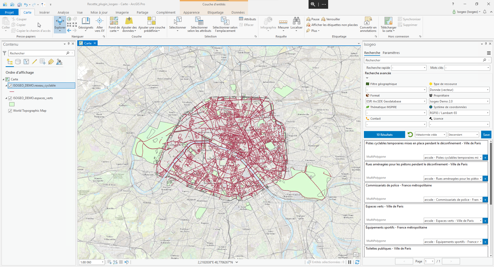

# Plugin Isogeo pour ArcGIS Pro

Vous rêviez d’un moteur de recherche de données dans votre SIG… Isogeo et ses partenaires l’ont fait !

Les plugins/widgets sont développés à partir de l’API Isogeo. Ils visent à faciliter la découverte et l’usage des données cataloguées directement dans votre SIG préféré. C’est la solution idéale pour valoriser les données SIG en interne.

Ainsi, le “moteur de recherche”, intégré sous forme de plugin, permet de trouver des données, de les ajouter à sa carte et d'en savoir plus sur la donnée (historique, précision, conditions de diffusion, contact, etc.).

Techniquement connecté aux catalogues de la plateforme Isogeo, il est alors possible pour l'utilisateur d'accéder en quelques clics à ses données, celles de son organisme, de ses partenaires et aux données ouvertes sans quitter son environnement de travail.

Les différents plugins et widgets partagent une base fonctionnelle commune, résumé ci-après :

* **Rechercher** une donnée dans le catalogue, en s’appuyant sur le système de filtres et de tri ;
* **Afficher** la donnée dans son logiciel (ou son application) grâce aux ressources renseignées dans Isogeo ;
* **Consulter** la fiche de métadonnées dans une fenêtre dédiée ;

---

## Caractéristiques

### Multilinguisme

L'application est disponible en 2 langues :

* Français
* Anglais

### Contributeurs

* Ce plugin Isogeo ArcGis Pro a été développé par le développeur freelance [Vianney DOLEANS](https://www.linkedin.com/in/vianneydoleans/) en 2020 dans le cadre d'une commande de la société Isogeo, sous **licence GPL3**.
  * vianney.doleans@gmail.com
  * [GitHub](https://github.com/VianneyDoleans)
  * [LinkedIn](https://www.linkedin.com/in/vianney*doleans*1158a3121/)
* Dans le cadre du développement de ce plugin Isogeo ArcGis Pro, le plugin Isogeo ArcMap produit par la société [GEOFIT](https://geofit.fr/), sous licence GPL3, a été utilisé.
  * [Site internet](https://geofit.fr/)
  * [LinkedIn](https://www.linkedin.com/company/geofit/?originalSubdomain=fr)

---

Date de la dernière mise à jour de cette documentation : {{ gitbook.time | date("DD/MM/YYYY") }}.
