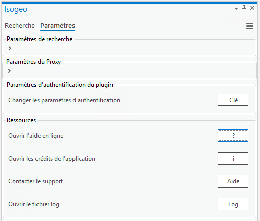
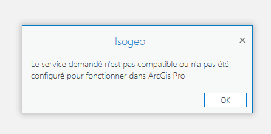

# Support et questions fréquentes

## Comment signaler un comportement anormal ? {#support}

Si vous obtenez un message d'erreur ou bien vous constatez un comportement anormal :

* aller dans l'onglet `Paramètres` 
* cliquer sur  le bouton `Aide` 
* remplir et adapter le modèle de mail qui s'est ouvert dans votre client de messagerie électronique
* intégrer le fichier log en le récupérant en cliquant sur le bouton prévu à cet effet 

Si aucun client de messagerie n'est configuré, il peut arriver que le modèle de mail ne s'affiche pas. Dans ces cas-là, envoyer un mail à [support+arcgispro@isogeo.fr](mailto:support+arcgispro@isogeo.fr).

___

## Questions fréquentes

### Pourquoi n'y a t'il aucune donnée dans mon plugin ? {#no-data}

Vérifier qu'au moins un partage alimente l'application : voir [comment partager à l'application depuis Isogeo](/usage/configuration.md#share).

### Pourquoi aucun résultat n'est ajoutable ?  {#no-add}

Pour qu'une donnée soit ajoutable à la carte, il faut que des informations le permettant soient cataloguées dans la métadonnée. 

Pour en savoir plus, [consulter la section dédiée dans la documentation](/usage/display.md).

### Pourquoi une erreur s'affiche-t-elle lorsque j'ajoute une donnée d'un service géographique à la carte ?  {#no-service-add}

Pour pouvoir ajouter une donnée au canvas, il faut d'abord y insérer une carte.
