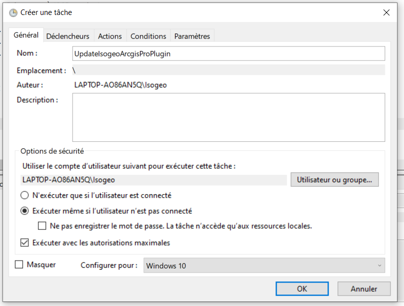
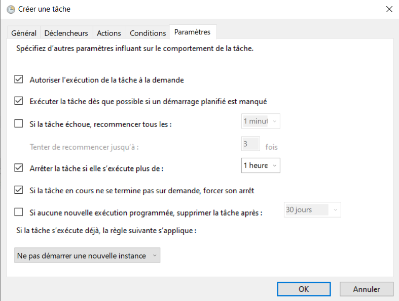

# Mise en place d'une tâche Windows de mise à jour automatique

## Pré-requis

Afin de pouvoir mettre en place la mise à jour automatique sur les postes, les prérequis suivant sont à respecter : 

* Accès de chaque utilisateur à un dossier (oneDrive, dossier sur le serveur) a minima en lecture sans condition d'accès
* Accès à ce dossier en écriture pour un administrateur
* Serveur ou poste avec droit administrateur Windows supportant le planificateur de tâche est muni d'une version de PowerShell supérieure ou égale à Powershell 2

### Windows supportant le planificateur de tâches

Les versions suivantes supportent le planificateur de tâche :

* Windows 10
* Windows 7
* Windows Server 2008 R2
* Windows Vista
* Windows Server 2008
* Windows Server 2003
* Windows Server 2019
* Windows XP
* Windows 2000

### Vérifier sa version de Powershell

Il est notamment possible de retrouver la version de Powershell en ouvrant un terminal Powershell et taper la commande suivante : 

```shell
Get-Host | Select-Object Version
```

## Installation administrateur

### Mise en place de la tâche plannifiée 

Prérequis :

* avoir mis en place un dossier partagé accessible

Pour mettre en place la tâche planifiée :

* Ouvrir le planificateur de tâches.
* Cliquer sur `Bibliothèque du planificateur de tâches`, la liste des tâches planifiées s'affiche alors.
* Dans `Actions` > `Créer une tâche` :  
* Dans `Général`, sélectionner `Exécuter même si l'utilisateur n'est pas connecté` et `Exécuter avec les autorisations maximales` et sélectionner la correcte version de Windows.



* Dans `Déclencheurs`, créer un nouveau déclencheur et choisir `à l'heure programmée` et `Chaque mois`, sélectionner mois : `tous les mois` et jours : `Dernier`.


* Dans `Actions`, créer une nouvelle action et sélectionner `Démarrer un programme` et choisir le fichier batch de mise à jour et renseigner les arguments suivants en remplaçant chemin_vers_AddIn par le chemin absolu vers le dossier contenant le AddIn et localisation des logs par le chemin absolu vers le dossier contenant les logs :

```
"chemin_vers_AddIn" >> "localisation_des_logs\plugin_arcgis_pro_logs.txt"
 ```


* Dans `Paramètres`, sélectionner `Exécuter la tâche dès que possible si un démarrage planifié est manqué` et `Arrêter la tâche si elle s'exécute plus de 1 heure` et `Si la tâche en cours ne se termine pas sur demande, forcer son arrêt`.



* Exécuter la tâche manuellement pour la première fois. Une fois la tâche exécutée, vérifier que le plugin a été récupéré dans me dossier partagé. Cette étape permet de vérification la configuration de la tâche.

## Configuration utilisateur

L'utilisateur doit alors configurer son poste comme expliqué dans la partie suivante : [Initialisation utilisateur](update/user.md). 