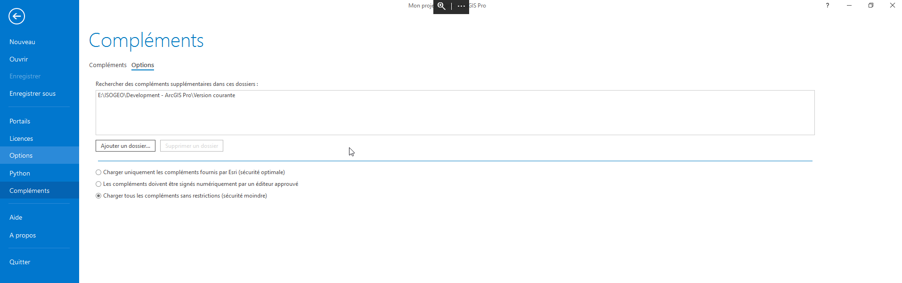

# Installation collective

## Pré-requis

Afin de pouvoir mettre en place la mise à jour générale sur tous les postes par l'administrateur, les prérequis suivants sont à respecter : 

* Accès de chaque utilisateur à un dossier (oneDrive, dossier sur le serveur) a minima en lecture sans condition d'accès
* Accès à ce dossier en écriture pour un administrateur

## Démarche administrateur

### Initialisation

Pour mettre en place la mise à jour automatique, il faut mettre en place un dossier accessibles à tous les utilisateur du plugin dans lequel le fichier `Isogeo.AddIn.esriAddinX` se trouvera en permanence et le communiquer à chacun des utilisateurs pour qu'il puisse configurer son poste.

### Mise à jour

Lorsqu'une nouvelle mise à jour du plugin a lieu, il faut alors simplement remplacer le fichier `Isogeo.AddIn.esriAddinX` de la version précédente par celui de la nouvelle version. Le plugin sera alors mis à jour automatiquement à la prochaine ouverture de ArcGis Pro si correctement configuré par l'utilisateur. 

## Démarche utilisateur

### Configuration

Pour configurer ArcGis Pro à mettre à jour automatiquement le plugin Isogeo :

* Aller dans Projet > Compléments > Options et ajouter un nouveau dossier (le chemin fournit par l'administrateur) et sélectionner "Charger tous les compléments sans restrictions"

* Fermer ArcGis Pro et le rouvrir.
* Le plugin est alors installé.

Si le plugin est modifié, il sera automatiquement mis à jour. Si le plugin est supprimé, il sera désinstallé automatiquement également.
