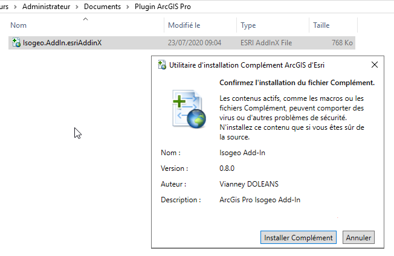
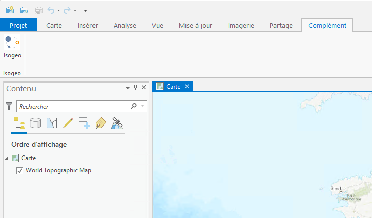
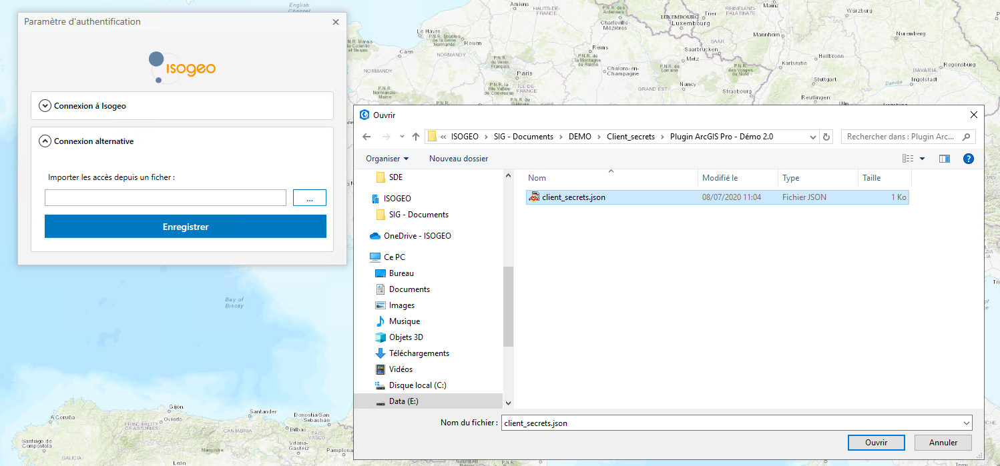
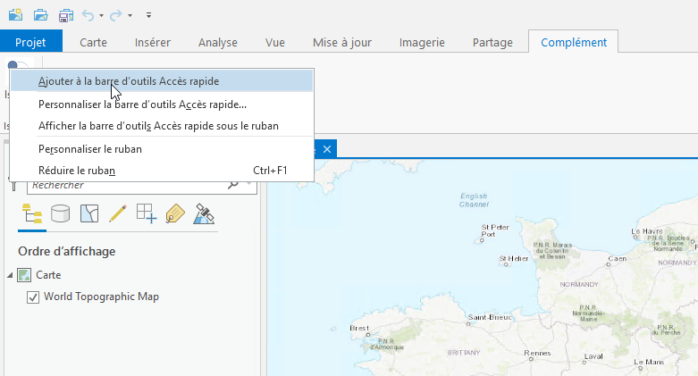

# Installation

## Installer le plugin {#installation}

1. Dézipper le fichier reçu dans un dossier dédié. Pour être cohérent avec le fonctionnement d'ArcGIS, nous recommandons d'utiliser le dossier des _AddIns_ dans `Mes Documents` : `C:\Users\$USER\Documents\ArcGIS\AddIns\Desktop10.X\Isogeo` \(noter le X à remplacer selon votre version\)
2. Double-cliquer sur **ArcGISProAddinIsogeo.esriAddIn** :
3. La fenêtre suivante s'ouvre :
   
4. Valider en cliquant sur **Installer Complément**. Une petite boîte de dialogue confirme que l'installation a réussi : "_Installation réussie_".

Le plugin est désormais référencé dans les compléments d'ArcGIS Pro. Il s'agit maintenant de l'ajouter à l'interface de travail d'ArcGIS Pro.

## Ajouter le plugin à l'interface {#add-to-ui}

1. Lancer ArcGIS Pro ;
2. Ouvrir un projet existant ou démarrer un nouveau ;
3. Ouvrir le menu **Compléments** et cliquer sur le logo Isogeo ;
   
4. La fenêtre d'authentification du plugin se lance.

## Authentifier le plugin {#authentication}

1. Cliquer sur *Connexion alternative* ;
2. Importer le fichier *clientsecrets.json* transmis par l'équipe Isogeo ;
   
3. Cliquer sur *Enregistrer* ;
4. Le plugin se lance.

## Ajouter le plugin à la barre d'outils Accès rapide {#add-command-toolbar}

1. Ouvrir le menu **Compléments** ;
2. Faire un clic droit sur le logo sogeo et sélectionner *Ajouter à la barre d'outils Accès rapide* ;

   

3. Le plugin apparait désormais dans la barre ;

   
