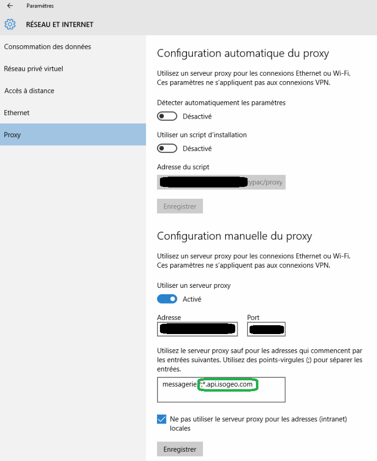

# Prérequis

## Accès Isogeo {#isogeo}

### Pour consulter ses propres données

* au moins un groupe de travail Isogeo ;
* au moins un catalogue contenant au moins une métadonnée, partagé au plugin ;
* des clés d'authentification auprès de l'API Isogeo ;

---

## Environnement technique {#technical}

* ArcGIS Pro 3.x (la version du plugin pour ArcGIS Pro 2.x est toujours disponible au besoin mais n'est plus maintenue)
* [Microsoft .NET Framework 4.8](https://dotnet.microsoft.com/download/dotnet-framework/net48)
* une connexion autorisée et configurée \(proxy, pare-feu...\) vers [https://v1.api.isogeo.com/\*](https://v1.api.isogeo.com/) et [https://id.api.isogeo.com/\*](https://v1.api.isogeo.com/)

Si la connexion est derrière un proxy, il est parfois possible de le configurer directement depuis les paramètres Windows. Exemple sous Windows 10 :

> NB : En mode On-premises, les urls de l'API Isogeo doivent également être accessibles sur le poste client. 