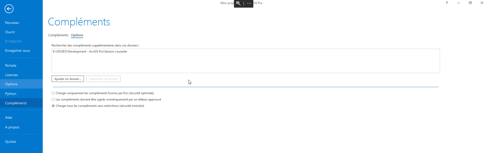

# Démarche utilisateur

## Configuration

Pour configurer ArcGis Pro à mettre à jour automatiquement le plugin Isogeo :

* Aller dans Projet > Compléments > Options et ajouter un nouveau dossier (le chemin fournit par l'administrateur) et sélectionner "Charger tous les compléments sans restrictions"

* Fermer ArcGis Pro et le rouvrir.
* Le plugin est alors installé.

Si le plugin est modifié, il sera automatiquement mis à jour. Si le plugin est supprimé, il sera désinstallé automatiquement également.
