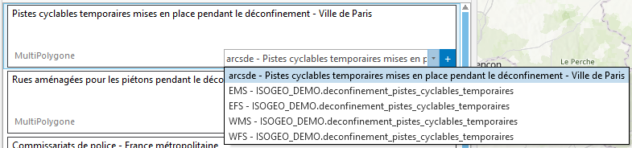

# Ajouter une donnée à la carte

Pour ajouter une donnée à la carte, les différentes options sont accessible en bas à droite de chaque item de la liste des résultats.

Il suffit de choisir une option dans la liste déroulante puis de cliquer sur le bouton `+`.

---

## Critères

### Données fichier {#add-file}

Le chemin vers la donnée doit être rempli dans le champ `Emplacement de la donnée` sur [https://app.isogeo.com](https://app.isogeo.com). Ce chemin doit être accessible :

* par l'utilisateur ayant lancé ArcGIS Pro (droits en lecture);
* depuis le poste sur lequel le plugin se trouve (en local ou via le réseau local).

Formats :

* Esri FileGDB
* Esri Shapefile

### Données SDE {#add-sde}

Une table SDE pourra être ajoutée par le plugin dans les conditions suivantes :

* L'utilisateur a renseigné le fichier de connexion SDE à utiliser dans l'onglet `Paramètres`. Un seul fichier de connexion SDE est configurable.
* La fiche documentant la table a été créée à partir du scan FME Isogeo. En créant une fiche manuellement dans [https://app.isogeo.com](https://app.isogeo.com), il est impossible de renseigner le champ _name_ nécessaire à l’ajout de la table.

### Services géographiques {#add-service}

Le plugin supporte les couches de services documentés automatiquement et associées aux métadonnées de données :

* Web Feature Service \(WFS\)
* Web Map Service \(WMS\)
* Web Map Tile Service \(WMTS\)
* Esri Feature Service \(EFS\)
* Esri Map Service \(EMS\)

Consulter [l'aide en ligne Isogeo au sujet du recensement automatisé des services et de l'association couche de service / donnée cataloguée](http://help.isogeo.com/fr/features/inventory/md_services/srv_intro.html).

#### Cas particuliers

##### Accès au serveur géographique {#srv-403}

A l'ajout d'un service, la fenêtre d'erreur suivante peut s'afficher :

Pour qu'ArcGIS Pro puisse accéder aux données via un service géographique, il est nécessaire que l'URL racine du serveur géographique soit pleinement accessible en lecture.

Par exemple, si les services à ajouter sont sur une URL du type : https://sig.monorganisme.fr/arcgis/rest/services/ISOGEO, alors l'URL racine du serveur géographique doit également être accessible en lecture : https://sig.monorganisme.fr/arcgis/rest/services.
