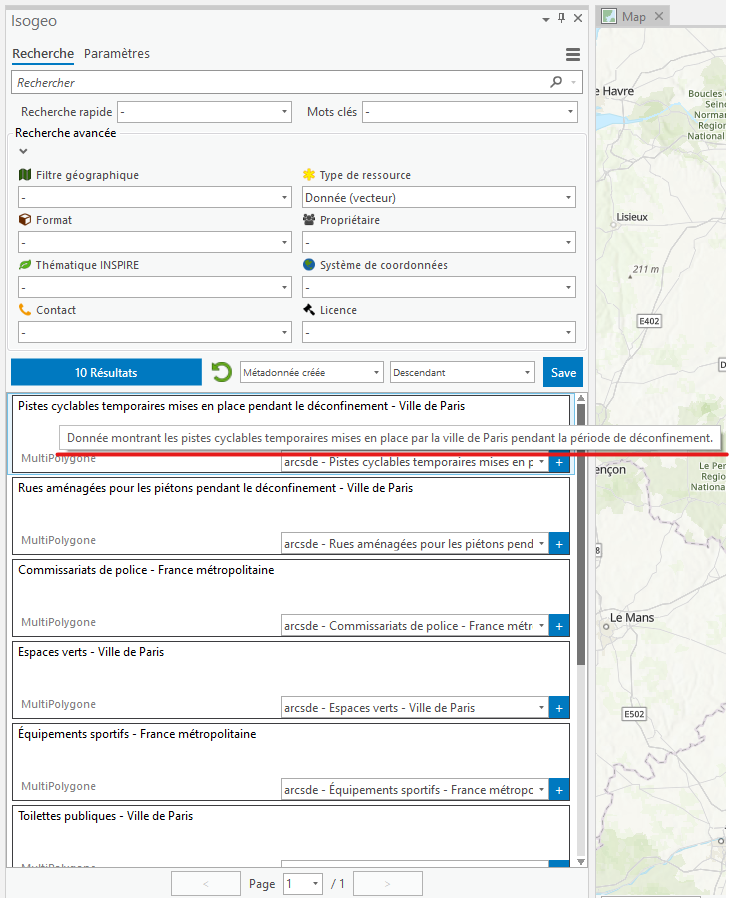
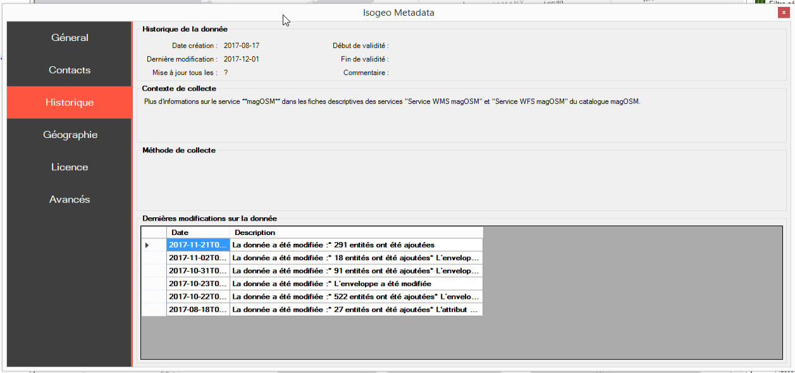

# Métadonnées

## Consulter le résumé {#abstract}

Dans la liste des résultats, le résumé de la métadonnées s'affiche au survol du titre.

## Consulter la métadonnée détaillée {#metadata}

En cliquant sur un item de la liste des résultats, l'utilisateur peut consulter la fiche de métadonnées Isogeo correspondant à la donnée. Elle s'affiche alors dans une fenêtre indépendante contenant les informations réparties dans différents onglets verticaux :

