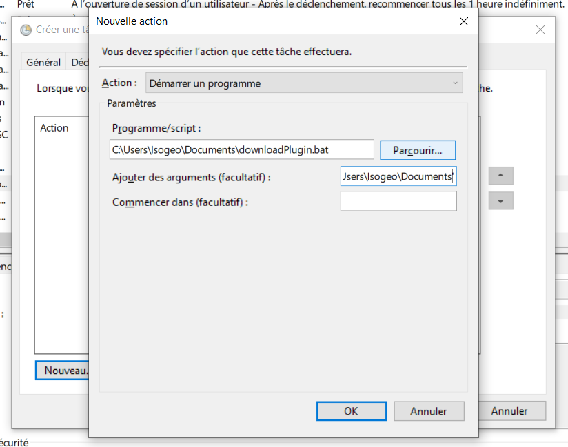

# Installation

## Mise en place de la tâche plannifiée 

Pré-requis :

* avoir mis en place un dossier partagé accessible

Pour mettre en place la tâche planifiée :

* Ouvrir le planficateur de tâche.
* Cliquer sur `Bibliothèque du planificateur de tâches`, la liste des tâches planifiées s'affiche alors.
* Dans `Actions` > `Créer une tâche` :  
* Dans `Général`, selectionner `Exécuter même si l'utilisateur n'est pas connecté` et `Exécuter avec les autorisations maximales` et selectionner la correcte version de Windows.


* Dans `Déclencheurs`, créer un nouveau déclencheur et choisir `à l'heure programmée` et `Chaque mois`, selectionner mois : `tous les mois` et jours `Dernier`.


* Dans `Actions`, créer une nouvelle action et selectionner `Démarrer un programme` et choisir le fichier batch de mise à jour et renseigner les arguments suivants en remplaçant chemin_vers_AddIn par le chemin absolu vers le dossier contenant le AddIn et localisation des logs par le chemin absolu vers le dossier contenant les logs :

```
"chemin_vers_AddIn" >> "localisation_des_logs\plugin_arcgis_pro_logs.txt"
 ```





* Dans `Paramètres`, selectionner `Exécuter la tâche dès que possible si un démarrage planifié est manqué` et `Arrêter la tâche si elle s'exécute plus de 1 heures` et `Si la tâche en cours ne se termine pas sur demande, forcer son arrêt`.


* Exécuter la tâche manuellement pour la première fois. Une fois la tâche exécutée, vérifier que le plugin a été récupéré dans me dossier partagé.